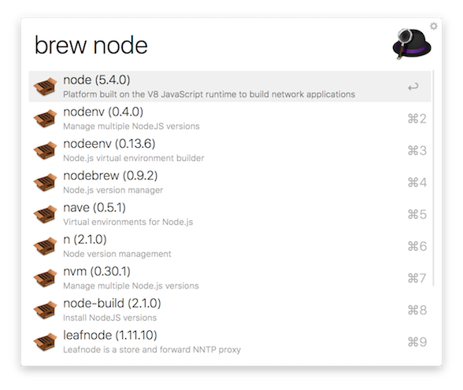

# Alfred Workflow for [Homebrew](http://brew.sh/)

## Installation

[Download](../../../raw/master/homebrew/homebrew.alfredworkflow) and open the
workflow file.

## Usage

1. `Alfred Hotkey`
2. `brew {name}`
